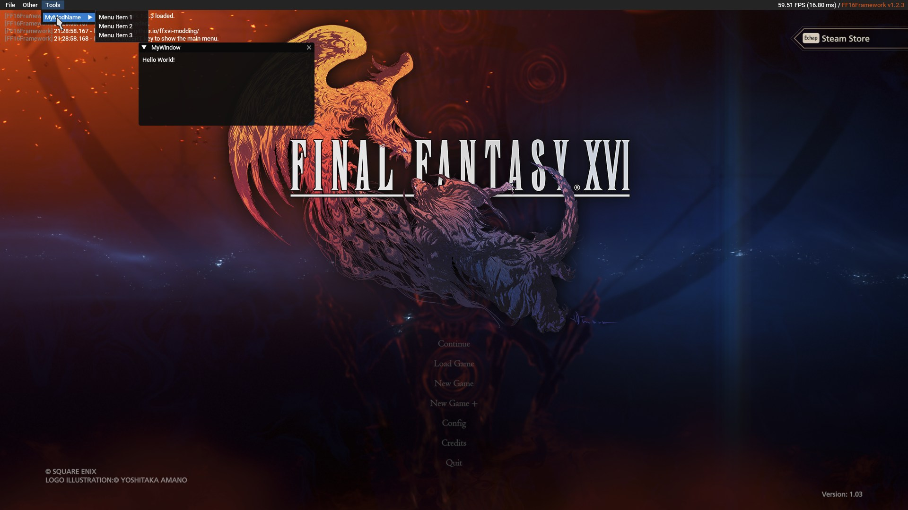

# :material-window-restore: ImGui Overlay API

The framework exposes a ImGui overlay for use by other mods. 

While ImGui is pretty straightforward to use, here are some guides to get started:

* [Interactive Manual/API Reference](https://pthom.github.io/imgui_manual_online/manual/imgui_manual.html)

### Quick Guide

1. Install the [NenTools.ImGui.Interfaces](<https://www.nuget.org/packages/NenTools.ImGui.Interfaces/>) & [NenTools.ImGui.Abstractions](https://www.nuget.org/packages/NenTools.ImGui.Abstractions/) NuGet packages into your mod project.
2. Add `ff16.utility.framework` as a mod dependency in your ModConfig in `ModDependencies`. You may also use the Reloaded-II UI (Edit Mod) to add it.
3. In your code, grab `IImGui` and `IImGuiSupport`:
```csharp
_imGui = _modLoader.GetController<IImGui>();
if (!_imGui.TryGetTarget(out IImGui imGui))
{
    _logger.WriteLine($"[{_modConfig.ModId}] Could not get IImGui.");
    return;
}

_imGuiShell = _modLoader.GetController<IImGuiShell>();
if (!_imGuiShell.TryGetTarget(out IImGuiShell imGuiShell))
{
    _logger.WriteLine($"[{_modConfig.ModId}] Could not get IImGuiShell.");
    return;
}
```

4. Create a component inheriting from `IImGuiComponent` decorated with the `ImGuiMenu`:
```csharp
// category is the top menu entry which this component will render menu items to.
// priority is only used for sorting purposes.
// owner should be your mod name. This is used as final sorting (alphabetically) across mods, when the same priority is used.
[ImGuiMenu(Category = "Other", Priority = 0, Owner = "MyImGuiMod")]
public class MyImGuiComponent : IImGuiComponent
{
    // If this is enabled, this will also render while the ImGui overlay is currently hidden
    public bool IsOverlay => false;

    private readonly IImGui _imgui;

    public MyImGuiComponent(IImGui imgui)
    {
        _imgui = imgui;
    }

    public void RenderMenu()
    {
        // Write code to render menu entries here.
        // By default, the shell will render a top menu bar which you can add elements to.
        if (_imgui.BeginMenu("MyModSubMenu"))
        {
            _imgui.MenuItem("Menu Item 1");
            _imgui.MenuItem("Menu Item 2");
            _imgui.MenuItem("Menu Item 3");

            imgui.EndMenu();
        }
    }

    public void Render(IImGuiShell imguiShell)
    {
        // Insert code to render anything here.
        if (_imgui.Begin("MyWindow", ref _windowOpen, ImGuiWindowFlags.ImGuiWindowFlags_None))
        {
            _imgui.Text("Hello World!");
        }

        _imgui.End();
    }
}
```

5. Register your component to the ImGui system:
```csharp
imguiShell.AddComponent(new MyImGuiComponent(_imGui));

// The render order will look like the following:
// File
//   ...
// Tools
//   ...
// Other
//   (MyImGuiComponent - Priority: 0, Owner: "MyImGuiMod")
//     --> This is where MyImGuiComponent.RenderMenu() is called. <--
//       -> MyModSubMenu
//         -> Menu Item 1
//         -> Menu Item 2
//         -> Menu Item 3
//   (some other mod component - Priority: 0, Owner: "OtherModName")
//     ...
//   (some component you registered - Priority: 1, Owner: "MyImGuiMod")
//     ...
```

!!! warning

    The user may choose to not load ImGui based on the framework settings. If you are running logic that needs to run depending on the overlay, ensure to check that `ImGuiSupport.IsOverlayLoaded` is `true`.

That's all you should needed to render something on screen.

<figure markdown>
  { width="600" }
</figure>

### :material-image: Textures/Images

If you need to render textures, you should:

* Grab a `IImGuiTextureManager` instance from `IImGuiShell`
* Pass it to your component. On `Render`, load the texture using `IImGuiTextureManager.LoadImage`. **Make sure to only do this once and not every frame!** You may choose to queue image loads or synchronously load images.
* Pass the newly added image's `TexId` to `IImGui.Image`, etc.
* Make sure to dispose of these textures when you don't need to use them anymore (closing window, etc). Texture/Image lifetime disposal is entirely up to you.

!!! example

    ```csharp
    private IQueuedImGuiImage? _iconImage;
    private CancellationTokenSource _loadCts = new CancellationTokenSource();

    public void Render(IImGuiShell imGuiShell)
    {
        if (!IsOpen)
        {
            UnloadResourcesIfNeeded();
            return;
        }

        // Queue an image for load. It won't load immediately, 
        if (_iconImage is null)
        {
            string path = _modLoader.GetDirectoryForModId(_modConfig.ModId);

            // Queue an image to be loaded from disk. ImageSharp handles this and supports various formats.
            _iconImage = imGuiShell.TextureManager.QueueImageLoad(Path.Combine(path,    _modConfig.ModIcon), ct: _loadCts.Token);
        }

        // Display it if it's loaded.
        if (_iconImage.IsLoaded)
        {
            _imGui.Image(_imGui.CreateTextureRef(_iconImage.Image.TexId), new Vector2(_iconImage.Image.Width, _iconImage.Image.Height));
        }

        // You may also choose to load an image directly off a path without queueing it
        // This is a blocking operation though as the file has to be loaded and will lock the game until it's done.
        var image = imGuiShell.TextureManager.LoadImage("<my path>");

        // You can also load from a RGBA buffer.
        var image = imGuiShell.TextureManager.LoadImage(bytes, width, height);

        // Updating textures is also supported.
        imGuiShell.TextureManager.QueueUpdateImage(_iconImage, "<my path>");
        imGuiShell.TextureManager.Update(_iconImage, bytes); // Buffer is expected to match the dimensions of the current image.
        imGuiShell.TextureManager.Update(_iconImage, "<my path>"); // From image path, blocking.
    }

    // Ensure to dispose of the image off the GPU.
    // You should call this when you are closing a window.
    // (You may choose to persist it to cache it too, that's also fine)
    private void UnloadResourcesIfNeeded()
    {
        _iconImage?.Image?.Dispose();
        _iconImage = null;
    }
    ```
---

**For more info, refer to [NenTools.ImGui](https://github.com/Nenkai/NenTools.ImGui).**